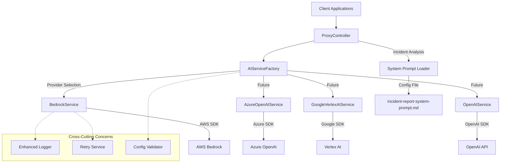

# AI Proxy Service

A vendor-agnostic AI proxy service built with NestJS and TypeScript. Features retry mechanisms, structured logging, configuration validation, and vendor abstraction for seamless AI provider integration.

## Features

### Core Capabilities
- **Vendor-Agnostic Architecture** - Abstract service pattern supports multiple AI providers (AWS, Azure, Google, OpenAI)
- **Enterprise-Grade Reliability** - Intelligent retry logic with exponential backoff and jitter
- **Configuration Validation** - Comprehensive schema validation with class-validator decorators
- **Structured Logging** - JSON-formatted logs with performance tracking and correlation IDs
- **Enhanced Error Handling** - Hierarchical exception system with retryability classification
- **Async System Prompt Loading** - File-based caching with mtime validation for optimal performance

### AI Integration Features
- **AWS Bedrock Integration** - Support for Claude, Titan, and other foundation models
- **Specialized Safety Analysis** - Dedicated incident report analysis with expert safety prompts
- **Model Discovery** - Comprehensive endpoint for provider and model information with pricing
- **Configurable Model Settings** - Per-operation model, token, and temperature configuration
- **Multi-Provider Support** - Ready for Azure OpenAI, Google Vertex AI, and OpenAI integration

### Production-Ready Features
- **Input Validation** - Comprehensive DTO validation with security constraints
- **Rate Limiting** - Configurable throttling (100 requests/minute by default)
- **Health Monitoring** - Detailed health checks with provider status
- **Security Hardening** - CORS, Helmet, input sanitization, and XSS protection
- **Performance Metrics** - Operation tracking with success rates and latency percentiles
- **API Documentation** - Interactive Swagger/OpenAPI documentation

## Architecture Overview



## Repository Structure

```
src/
├── main.ts                           # Application entry point
├── app.module.ts                     # Root module with P2 enhancements
├── common/                           # Shared services and utilities
│   ├── logger.service.ts             # Custom logging service
│   ├── enhanced-logger.service.ts    # Structured logging with performance tracking
│   ├── retry.service.ts              # Intelligent retry with exponential backoff
│   ├── config.schema.ts              # Configuration validation schemas
│   └── logging.interceptor.ts        # HTTP request/response logging
├── config/                           # Configuration files
│   ├── incident-report-system-prompt.md      # Expert safety analyst prompt
│   ├── aws-model-mappings.json               # AWS Bedrock model mappings
│   ├── azure-model-mappings.json             # Azure OpenAI model mappings (future)
│   ├── google-model-mappings.json            # Google Vertex AI mappings (future)
│   └── openai-model-mappings.json            # OpenAI model mappings (future)
└── proxy/
    ├── proxy.module.ts               # Proxy feature module
    ├── proxy.controller.ts           # REST API endpoints
    ├── dto/                          # Data transfer objects
    │   ├── prompt-request.dto.ts             # General prompt request validation
    │   ├── prompt-response.dto.ts            # Standardized response interface
    │   ├── incident-report-feedback.dto.ts   # Incident report validation
    │   ├── providers-response.dto.ts         # Provider/model information
    │   └── health-response.dto.ts            # Health check responses
    ├── exceptions/                   # Custom exception hierarchy
    │   ├── bedrock.exceptions.ts             # Bedrock-specific exceptions
    │   └── provider.exceptions.ts            # Base provider exception system
    ├── interfaces/
    │   └── ai-service.interface.ts           # Provider abstraction interface
    ├── types/
    │   └── provider.types.ts                 # Provider type definitions and unions
    └── services/
        ├── ai-service.factory.ts             # Provider factory with caching
        ├── base-ai.service.ts                # Abstract base service implementation
        ├── bedrock.service.ts                # AWS Bedrock integration
        └── system-prompt-loader.service.ts   # Async prompt loading with caching
```

## Quick Start

### Prerequisites

- Node.js (v18 or higher)
- npm or yarn
- AWS Account with Bedrock access
- AWS credentials configured

### Installation

1. **Clone the repository**
```bash
git clone https://github.com/your-username/demo-ai-proxy-service.git
cd demo-ai-proxy-service
```


2. **Install dependencies**
```bash
npm install
```

3. **Set up environment variables**
```bash
cp .env.example .env
```

4. **Configure environment variables in `.env`**

```env
# Core Application Configuration
PORT=3000
NODE_ENV=development

# Provider Configuration
AI_PROVIDER=aws                                    # Provider selection (aws|azure|google|openai)

# AWS Configuration (when AI_PROVIDER=aws)
AWS_REGION=us-east-1
AWS_ACCESS_KEY_ID=your-access-key-id
AWS_SECRET_ACCESS_KEY=your-secret-access-key
AWS_SESSION_TOKEN=your-session-token-if-using-temporary-credentials

# Model Defaults
BEDROCK_MODEL_ID=anthropic.claude-3-sonnet-20240229-v1:0
BEDROCK_MAX_TOKENS=1000
BEDROCK_TEMPERATURE=0.7
BEDROCK_TIMEOUT_MS=30000
BEDROCK_MAX_RETRIES=3

# Incident Analysis Configuration
INCIDENT_ANALYSIS_MODEL_ID=anthropic.claude-3-sonnet-20240229-v1:0
INCIDENT_ANALYSIS_MAX_TOKENS=2000
INCIDENT_ANALYSIS_TEMPERATURE=0.3
INCIDENT_ANALYSIS_SYSTEM_PROMPT_PATH=config/incident-report-system-prompt.md

# Retry and Resilience Configuration
GLOBAL_TIMEOUT_MS=30000
GLOBAL_MAX_RETRIES=3
RETRY_DELAY_MS=1000
RETRY_BACKOFF_MULTIPLIER=2

# Logging Configuration
LOG_LEVEL=INFO                                     # ERROR|WARN|INFO|DEBUG|VERBOSE
ENABLE_STRUCTURED_LOGGING=true
ENABLE_METRICS=false
ENABLE_TRACING=false

# Future Provider Configurations
# AZURE_OPENAI_KEY=your-azure-openai-key
# AZURE_OPENAI_ENDPOINT=your-azure-openai-endpoint
# GOOGLE_APPLICATION_CREDENTIALS=path/to/google-credentials.json
# OPENAI_API_KEY=your-openai-api-key
```

### Running the Application

**Development Mode** (with hot reload)
```bash
npm run start:dev
```

**Production Mode**
```bash
npm run build
npm run start:prod
```

The service will be available at:
- **Application**: http://localhost:3000
- **API Documentation**: http://localhost:3000/api/docs
- **API Endpoints**: http://localhost:3000/api/proxy

## API Documentation


### Interactive Documentation

Visit http://localhost:3000/api/docs for the complete Swagger/OpenAPI documentation where you can:
- View all available endpoints
- See request/response schemas
- Test endpoints directly in the browser
- View example requests and responses

### API Endpoints

#### Get All LLM Providers and Models

```http
GET /api/proxy/providers
```

**Response:**
```json
{
  "providers": [
    {
      "name": "Anthropic",
      "description": "Claude family of large language models",
      "website": "https://www.anthropic.com",
      "models": [
        {
          "id": "anthropic.claude-3-5-sonnet-20240620-v1:0",
          "name": "Claude 3.5 Sonnet",
          "description": "Most intelligent model with balanced performance for complex tasks",
          "maxTokens": 200000,
          "supportsStreaming": true,
          "inputCostPer1K": 0.003,
          "outputCostPer1K": 0.015
        }
      ]
    }
  ],
  "totalModels": 21,
  "defaultModel": "anthropic.claude-3-sonnet-20240229-v1:0",
  "timestamp": "2025-09-12T20:09:18.273Z"
}
```

#### Send Prompt to AI Model

```http
POST /api/proxy/prompt
Content-Type: application/json

{
  "prompt": "What is artificial intelligence?",
  "modelId": "anthropic.claude-3-sonnet-20240229-v1:0",
  "maxTokens": 1000,
  "temperature": 0.7
}
```

**Response:**
```json
{
  "response": "Artificial intelligence (AI) refers to...",
  "modelId": "anthropic.claude-3-sonnet-20240229-v1:0",
  "usage": {
    "inputTokens": 15,
    "outputTokens": 128
  }
}
```

#### Incident Report Safety Analysis

```http
POST /api/proxy/incident-report-feedback
Content-Type: application/json

{
  "incidentReport": "A worker slipped on a wet floor in the warehouse. The employee was carrying boxes when they fell and injured their wrist. The floor was wet due to a leaking pipe that had not been reported."
}
```

**Response:**
```json
{
  "response": "**INCIDENT ANALYSIS REPORT**\n\n**Risk Classification:** Medium-High Risk\n\n**Primary Hazards Identified:**\n1. Workplace slip/fall hazard due to wet surfaces\n2. Inadequate hazard reporting systems\n3. Poor housekeeping and maintenance protocols...",
  "modelId": "anthropic.claude-3-sonnet-20240229-v1:0",
  "usage": {
    "inputTokens": 1847,
    "outputTokens": 1523
  }
}
```

### Endpoint Comparison: `sendPrompt` vs `processIncidentReportFeedback`

| Feature | **sendPrompt** | **processIncidentReportFeedback** |
|---------|----------------|----------------------------------|
| **Purpose** | General-purpose AI prompting | Specialized safety incident analysis |
| **User Control** | Full parameter customization | Predefined safety-optimized settings |
| **Model Selection** | User-configurable (`modelId` parameter) | Fixed: `anthropic.claude-3-sonnet-20240229-v1:0` |
| **Temperature** | User-configurable (0.0-1.0) | Fixed: `0.3` (focused analytical responses) |
| **Max Tokens** | User-configurable (up to 4096) | Fixed: `2000` (comprehensive safety analysis) |
| **System Prompt** | None (direct user input) | Expert safety analyst persona automatically prepended |
| **Input Validation** | Generic prompt validation | Specialized incident report validation (up to 50k chars) |
| **Response Type** | General AI response | Structured safety analysis with risk assessment |
| **Use Case** | Development, testing, general queries | Production safety management systems |
| **Consistency** | Varies based on user parameters | Standardized expert-level analysis |

#### When to Use Each Endpoint

**Use `sendPrompt` for:**
- Development and testing
- Custom AI applications requiring parameter control
- Experimental prompts with different models/settings
- General-purpose AI interactions
- Research and experimentation

**Use `processIncidentReportFeedback` for:**
- Production workplace safety systems
- Standardized incident analysis
- Compliance and regulatory reporting
- Consistent safety assessment across organization
- Emergency response and risk management

#### Technical Implementation Differences

**`sendPrompt` Request Flow:**
1. Validates user-provided parameters
2. Sends prompt directly to specified Bedrock model
3. Returns raw AI response

**`processIncidentReportFeedback` Request Flow:**
1. Validates incident report content (up to 50,000 characters)
2. Loads expert safety analyst system prompt from `config/incident-report-system-prompt.md`
3. Combines system prompt with incident report
4. Sends to pre-optimized Bedrock model with safety-focused settings
5. Returns structured expert safety analysis

#### Health Check

```http
GET /api/proxy/health
```

**Response:**
```json
{
  "status": "ok",
  "timestamp": "2025-09-12T18:33:48.905Z",
  "endpoints": [
    "GET /api/proxy/health - This endpoint",
    "GET /api/proxy/providers - Get all LLM providers and models",
    "POST /api/proxy/health - Health check",
    "POST /api/proxy/prompt - Send prompt to Bedrock",
    "POST /api/proxy/incident-report-feedback - Analyze incident reports with expert safety feedback"
  ]
}
```

#### API Information

```http
GET /api/proxy
```

## Enterprise Features

### Configuration Management

#### Schema Validation
The service includes comprehensive configuration validation using class-validator decorators:

```typescript
// Automatic validation of environment variables at startup
// Prevents misconfiguration in production
export class ConfigurationSchema {
  @IsEnum(NodeEnvironment)
  nodeEnv?: NodeEnvironment = NodeEnvironment.DEVELOPMENT;

  @IsNumber()
  @IsPositive()
  @Min(1000)
  @Max(65535)
  port?: number = 3000;

  @IsString()
  @IsOptional()
  region?: string = 'us-east-1';
}
```

#### Multi-Provider Configuration
Ready for multiple AI providers with unified configuration:

```typescript
// Provider abstraction allows seamless switching
export interface AIServiceProvider {
  name: ProviderName;
  description: string;
  models: ModelInfo[];
  defaultModel: string;
}

// Supports: 'aws' | 'azure' | 'google' | 'openai'
```

### Retry and Resilience

#### Intelligent Retry Service
Built-in retry logic with exponential backoff and jitter:

```typescript
export class RetryService {
  // Automatically retries on:
  // - Network errors (ECONNRESET, ETIMEDOUT, etc.)
  // - HTTP 5xx server errors
  // - HTTP 429 (Too Many Requests)
  // - Provider-specific transient errors

  async executeWithRetry<T>(
    operation: () => Promise<T>,
    retryCondition: RetryCondition = RetryConditions.default,
    config: Partial<RetryConfig> = {}
  ): Promise<RetryResult<T>>
}
```

#### Configuration Options
```env
GLOBAL_MAX_RETRIES=3              # Maximum retry attempts
RETRY_DELAY_MS=1000               # Base delay between retries
RETRY_BACKOFF_MULTIPLIER=2        # Exponential backoff multiplier
GLOBAL_TIMEOUT_MS=30000           # Operation timeout
```

### Enhanced Logging and Monitoring

#### Structured Logging
JSON-formatted logs with comprehensive metadata:

```json
{
  "timestamp": "2025-09-16T14:51:34.071Z",
  "level": "INFO",
  "message": "Incident report analysis completed",
  "context": "BaseAIService",
  "metadata": {
    "requestId": "aws-1726498294071-xyz123",
    "duration": 2847,
    "modelId": "anthropic.claude-3-sonnet-20240229-v1:0",
    "provider": "aws",
    "responseLength": 1523
  },

  "traceId": "abc123def456",
  "correlationId": "req-789xyz"
}
```

>**traceId**: Unique identifier for distributed tracing across service boundaries

>**correlationId**: Request-specific identifier for linking related log entries

#### Performance Tracking
Automatic performance metrics collection:

```typescript
export class PerformanceTracker {
  // Tracks operation duration, success rate, error classification
  // Provides P95 latency, error breakdown, and throughput metrics
  
  getPerformanceMetrics(): {
    totalOperations: number;
    successRate: number;
    averageDuration: number;
    p95Duration: number;
    errorBreakdown: Record<string, number>;
  }
}
```

#### Monitoring Configuration
```env
ENABLE_STRUCTURED_LOGGING=true    # JSON log format
ENABLE_METRICS=true               # Performance metrics collection
ENABLE_TRACING=true               # Request tracing with correlation IDs
```

### Error Handling and Exception Hierarchy

#### Enhanced Exception System
Hierarchical exception handling with retry classification:

```typescript
export class AIProviderError extends Error {
  public readonly isRetryable: boolean;
  public readonly errorCategory: 'network' | 'authentication' | 'rate_limit' | 'model' | 'input' | 'unknown';
  public readonly metadata: Record<string, any>;
  
  // Automatic determination of retryability based on error type
  // Structured error metadata for debugging and monitoring
}
```

#### Provider-Specific Exceptions
- `BedrockConnectionError` - Network/connection issues
- `BedrockAuthenticationError` - AWS credential problems  
- `BedrockRateLimitError` - API throttling
- `BedrockModelError` - Model-specific issues
- `BedrockTimeoutError` - Request timeouts

### System Prompt Management

#### Async Prompt Loading
Optimized system prompt loading with file-based caching:

```typescript
export class SystemPromptLoader {
  // Features:
  // - Async file operations (non-blocking)
  // - mtime-based cache invalidation
  // - Memory-efficient caching
  // - Error resilience with fallbacks
  
  async getIncidentPrompt(): Promise<string> {
    // Automatically caches and invalidates based on file changes
  }
}
```

#### Configuration
```env
INCIDENT_ANALYSIS_SYSTEM_PROMPT_PATH=config/incident-report-system-prompt.md
```

### Vendor Abstraction

#### Abstract Service Pattern
Clean abstraction layer for multiple AI providers:

```typescript
export abstract class BaseAIService implements AIServiceInterface {
  // Unified interface for all providers
  abstract invokeModel(request: PromptRequestDto): Promise<PromptResponse>;
  abstract getAvailableProviders(): ProviderInfo[];
  abstract getProviderName(): ProviderName;
  abstract healthCheck(): Promise<{ status: 'healthy' | 'unhealthy' }>;
  
  // Shared implementation for incident analysis
  async processIncidentReportFeedback(incidentReport: string): Promise<PromptResponse> {
    // Uses retry service, performance tracking, and enhanced logging
  }
}
```

#### Service Factory
Provider instantiation with caching and dependency injection:

```typescript
export class AIServiceFactory {
  // Features:
  // - Provider caching for performance
  // - Race condition prevention
  // - Dependency injection for cross-cutting concerns
  // - Type-safe provider selection
  
  async getService(providerName: ProviderName): Promise<AIServiceInterface>
}
```

## Supported Models


The service supports various AWS Bedrock models:
- **Anthropic Claude** models (claude-3-sonnet, claude-3-haiku, etc.)
- **Amazon Titan** models
- Other Bedrock-compatible models

The service automatically handles different request/response formats for each model family.

## Logging and Monitoring

### Enhanced Logging System

The application features a dual-logging system:

#### 1. Standard NestJS Logging (`logger.service.ts`)
- Traditional log format for development
- Context-aware logging with service names
- Configurable log levels

#### 2. Enhanced Structured Logging (`enhanced-logger.service.ts`)
- JSON-formatted output for log aggregation systems
- Performance tracking with operation metrics
- Correlation IDs and trace IDs for distributed tracing
- Metadata enrichment for debugging

### Logging Configuration

Control logging behavior via environment variables:

```env
LOG_LEVEL=INFO                      # ERROR|WARN|INFO|DEBUG|VERBOSE
ENABLE_STRUCTURED_LOGGING=true      # Enable JSON log format
ENABLE_METRICS=true                 # Performance metrics collection
ENABLE_TRACING=true                 # Request correlation tracking
```

### Log Examples

#### Standard Logging (Development)
```
[9:51:34 AM] [INFO] [BedrockService] Loaded model mappings for aws provider
[9:51:34 AM] [INFO] [BedrockService] BedrockService initialized with region: us-east-1
[9:51:34 AM] [INFO] [NestApplication] Nest application successfully started
```

#### Structured Logging (Production)
```json
{
  "timestamp": "2025-09-16T14:51:34.071Z",
  "level": "INFO",
  "message": "Incident report analysis completed",
  "context": "BaseAIService",
  "metadata": {
    "requestId": "aws-1726498294071-abc123",
    "duration": 2847,
    "modelId": "anthropic.claude-3-sonnet-20240229-v1:0",
    "provider": "aws",
    "responseLength": 1523,
    "success": true
  },
  "traceId": "def456ghi789",
  "correlationId": "req-xyz123"
}
```

### Performance Metrics

The enhanced logger automatically tracks:

- **Operation Duration**: Start-to-finish timing
- **Success Rates**: Success/failure ratios
- **Error Classification**: Categorized error types
- **Latency Percentiles**: P50, P95, P99 response times
- **Throughput**: Requests per second metrics

#### Metrics Access
```typescript
// Get metrics for specific operations
const metrics = enhancedLogger.getPerformanceMetrics('incident-report-analysis');

// Returns:
// {
//   totalOperations: 100,
//   successRate: 0.95,
//   averageDuration: 2340,
//   p95Duration: 4200,
//   errorBreakdown: {
//     "NetworkError": 3,
//     "TimeoutError": 2
//   }
// }
```

### Request Tracking

Every request gets a unique ID for end-to-end tracing:

```
Incoming POST /api/proxy/incident-report-feedback - IP: ::1 - User-Agent: curl/7.68.0
[aws-1726498294071-abc123] Processing incident report feedback request
[aws-1726498294071-abc123] System prompt loaded
[aws-1726498294071-abc123] Invoking expert analysis with optimized settings
[aws-1726498294071-abc123] Incident report analysis completed in 2847ms
POST /api/proxy/incident-report-feedback 200 - 2847ms
```
### Error Detection and Alerting

#### Comprehensive Error Context
```json
{
  "timestamp": "2025-09-16T14:51:34.071Z",
  "level": "ERROR",
  "message": "Failed to invoke model after 3 attempts",
  "context": "RetryService",
  "metadata": {
    "requestId": "aws-1726498294071-err456",
    "attempts": 3,
    "totalElapsedMs": 15234,
    "lastError": "ThrottlingException",
    "provider": "aws",
    "modelId": "anthropic.claude-3-sonnet-20240229-v1:0"
  },
  "error": {
    "name": "BedrockRateLimitError",
    "message": "Request was throttled by AWS Bedrock",
    "stack": "...",
    "code": "ThrottlingException"
  }
}
```

## Development

### Available Scripts

```bash
# Development
npm run start:dev    # Start with hot reload
npm run start:debug  # Start in debug mode

# Production
npm run build        # Build the application
npm run start:prod   # Start production build

# Code Quality
npm run format       # Format code with Prettier
npm run lint         # Run ESLint
npm run lint:fix     # Fix ESLint issues

# Testing
npm run test         # Run unit tests
npm run test:watch   # Run tests in watch mode
npm run test:cov     # Run tests with coverage
npm run test:e2e     # Run end-to-end tests
```

### Environment Variables

| Variable | Description | Default |
|----------|-------------|---------|
| `AWS_REGION` | AWS region for Bedrock | `us-east-1` |
| `AWS_ACCESS_KEY_ID` | AWS access key | Required |
| `AWS_SECRET_ACCESS_KEY` | AWS secret key | Required |
| `AWS_SESSION_TOKEN` | AWS session token (for temporary credentials) | Optional |
| `BEDROCK_MODEL_ID` | Default Bedrock model ID | `anthropic.claude-3-sonnet-20240229-v1:0` |
| `BEDROCK_MAX_TOKENS` | Default max tokens | `1000` |
| `BEDROCK_TEMPERATURE` | Default temperature | `0.7` |
| `PORT` | Server port | `3000` |
| `NODE_ENV` | Environment | `development` |
| `LOG_LEVEL` | Logging level | `INFO` |

## Error Handling

The application includes comprehensive error handling:
- Input validation errors (400 Bad Request)
- AWS service errors (500 Internal Server Error)
- Detailed error logging with stack traces
- Structured error responses with request IDs

## Security Considerations

- Environment variables for sensitive data
- Input validation and sanitization
- CORS enabled for cross-origin requests
- Sensitive data redaction in logs
- Request ID tracking for security auditing

## Monitoring and Production

### Performance Tracking
- Response times for all endpoints
- AI model performance monitoring
- Token usage tracking for cost optimization

### Error Detection
- Real-time error alerts with stack traces
- Request tracing with unique IDs
- Detailed context for debugging


## Testing

### Unit Tests
```bash
npm run test
```

### End-to-End Tests
```bash
npm run test:e2e
```

### Manual Testing

#### Basic Health Check
```bash
# Check service health and provider status
curl -X GET http://localhost:3000/api/proxy/health
```

#### Provider Discovery
```bash
# Get all available providers and models with pricing
curl -X GET http://localhost:3000/api/proxy/providers
```

#### General AI Prompting
```bash
# Send a basic prompt
curl -X POST http://localhost:3000/api/proxy/prompt \
  -H "Content-Type: application/json" \
  -d '{"prompt": "Hello, how are you?"}'

# Send a prompt with custom parameters
curl -X POST http://localhost:3000/api/proxy/prompt \
  -H "Content-Type: application/json" \
  -d '{
    "prompt": "Explain artificial intelligence in simple terms", 
    "modelId": "anthropic.claude-3-sonnet-20240229-v1:0",
    "maxTokens": 500,
    "temperature": 0.3
  }'
```

#### Incident Report Analysis
```bash
# Analyze a workplace incident
curl -X POST http://localhost:3000/api/proxy/incident-report-feedback \
  -H "Content-Type: application/json" \
  -d '{
    "incidentReport": "A worker slipped on a wet floor in the warehouse. The employee was carrying boxes when they fell and injured their wrist. The floor was wet due to a leaking pipe that had not been reported."
  }'

# Test with a more complex incident
curl -X POST http://localhost:3000/api/proxy/incident-report-feedback \
  -H "Content-Type: application/json" \
  -d '{
    "incidentReport": "During routine maintenance, an electrician received a minor shock while working on a control panel. The worker was wearing appropriate PPE but the circuit breaker was not properly locked out. The incident occurred at 2:30 PM on a Tuesday. No serious injuries occurred, but the worker was taken to the medical station for evaluation. The maintenance supervisor was notified immediately."
  }'
```

#### Testing Enterprise Features

##### Configuration Validation
```bash
# Test with invalid port (should fail startup)
PORT=99999 npm run start:dev

# Test with invalid log level (should fail startup)  
LOG_LEVEL=INVALID npm run start:dev

# Test with missing required AWS credentials (should fail gracefully)
AWS_ACCESS_KEY_ID= npm run start:dev
```

##### Retry Logic Testing
```bash
# Test retry behavior with network simulation
# (Configure temporary network issues to see retry logs)

# Check retry statistics in application logs
# Look for messages like: "🔄 Operation succeeded after 2 attempts in 3847ms"
```

##### Performance Monitoring
```bash
# Make multiple requests to generate performance metrics
for i in {1..10}; do
  curl -X POST http://localhost:3000/api/proxy/prompt \
    -H "Content-Type: application/json" \
    -d '{"prompt": "Test prompt '$i'"}' &
done

# Check structured logs for performance data
# Look for JSON logs with duration, successRate, p95Duration fields
```

##### Error Handling Testing
```bash
# Test with oversized prompt (should return 400 Bad Request)
curl -X POST http://localhost:3000/api/proxy/prompt \
  -H "Content-Type: application/json" \
  -d '{"prompt": "'$(python3 -c "print('x' * 50000)")'"}' 

# Test with invalid model ID (should return appropriate error)
curl -X POST http://localhost:3000/api/proxy/prompt \
  -H "Content-Type: application/json" \
  -d '{"prompt": "Hello", "modelId": "invalid-model-id"}'

# Test with invalid temperature (should return validation error)
curl -X POST http://localhost:3000/api/proxy/prompt \
  -H "Content-Type: application/json" \
  -d '{"prompt": "Hello", "temperature": 5.0}'
```

### Development Tools

#### Log Analysis
```bash
# Watch logs in real-time during development
npm run start:dev | grep "INFO"

# Filter specific operation logs
npm run start:dev | grep "incident-report-analysis"

# Monitor error logs
npm run start:dev | grep "ERROR\|WARN"
```

#### Configuration Testing
```bash
# Test different provider configurations
AI_PROVIDER=aws npm run start:dev
AI_PROVIDER=azure npm run start:dev  # (when implemented)

# Test retry configurations
GLOBAL_MAX_RETRIES=1 RETRY_DELAY_MS=500 npm run start:dev

# Test logging configurations
ENABLE_STRUCTURED_LOGGING=true ENABLE_METRICS=true npm run start:dev
```

#### Performance Profiling
```bash
# Enable verbose logging for performance analysis
LOG_LEVEL=VERBOSE ENABLE_METRICS=true ENABLE_TRACING=true npm run start:dev

# Monitor memory usage during load testing
node --max-old-space-size=4096 dist/main.js
```

### Advanced Features Roadmap

#### Content Guardrails Engine
- **PII Detection**: Automatic identification and redaction
- **Toxicity Analysis**: Content safety scoring and filtering  
- **Compliance Framework**: GDPR, OSHA, SOX validation
- **Custom Policies**: Configurable content rules per organization

#### Circuit Breaker Pattern
```typescript
export class CircuitBreakerService {
  // Prevent cascading failures
  // Automatic failure detection and recovery
  // Provider fallback mechanisms
}
```

#### Advanced Caching
```typescript
export class ResponseCacheService {
  // Intelligent response caching
  // Cost optimization for repeated queries
  // Cache invalidation strategies
}
```

#### Rate Limiting Per Provider/User
```typescript
export class AdvancedRateLimitService {
  // Per-provider rate limiting
  // User-based quotas
  // Cost management controls
}
```

#### Architecture Principles
1. **Vendor Neutrality**: All provider-specific logic isolated behind abstractions
2. **Fail-Safe Design**: Graceful degradation and intelligent retry mechanisms
3. **Observability First**: Comprehensive logging, metrics, and tracing
4. **Configuration Driven**: Runtime behavior controlled via environment variables
5. **Type Safety**: Leverage TypeScript for compile-time error prevention

#### Adding New Providers
1. Extend `BaseAIService` abstract class
2. Implement required abstract methods
3. Add provider to `AIServiceFactory` instantiation logic
4. Create provider-specific exception classes
5. Add configuration schema validation
6. Update model mappings in `config/` directory
7. Add comprehensive tests and documentation

## Security Considerations

### Current Security Features
- **Input Validation**: Class-validator decorators on all DTOs
- **Rate Limiting**: ThrottlerModule with configurable limits
- **CORS Configuration**: Cross-origin request handling
- **Error Sanitization**: Sensitive data exclusion in error responses
- **Request ID Tracking**: Audit trail for all operations
