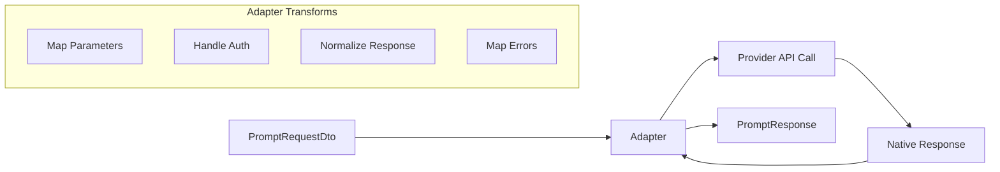
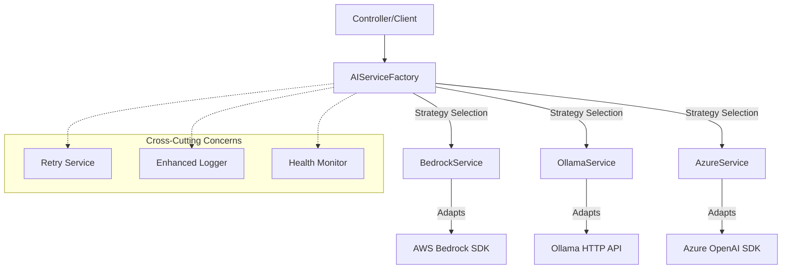

# Design Patterns Overview

## Purpose
This document explains the architectural patterns used to create a flexible, vendor-neutral AI proxy service. The design combines three complementary patterns to achieve clean separation of concerns and extensibility.

## Pattern Composition

This implementation strategically combines three Gang of Four patterns:

1. **Adapter Pattern**: Translates between internal DTOs and vendor-specific APIs
2. **Strategy Pattern**: Enables runtime selection of AI providers
3. **Abstract Factory Pattern**: Centralizes provider instantiation with caching

## Core Design Goals

- **Vendor Neutrality**: No provider-specific logic in business layer
- **Extensibility**: Add new providers without changing existing code
- **Testability**: Mock and test each provider independently
- **Type Safety**: Compile-time validation of provider operations
- **Performance**: Efficient caching and resource management

## 1. Adapter Pattern

### Problem Solved
AI providers have incompatible APIs with different:
- Request formats (parameter names, nesting, data types)
- Response structures (token counting, content extraction, metadata)
- Error handling (exception types, retry semantics)
- Authentication methods (API keys, SDKs, regional endpoints)

### Pattern Implementation

| GoF Role | Implementation | Responsibility |
|----------|---------------|----------------|
| **Target Interface** | `AIServiceInterface` + `BaseAIService` | Unified contract for all AI operations |
| **Adapters** | `BedrockService`, `OllamaService`, etc. | Provider-specific translation logic |
| **Adaptees** | Vendor SDKs/APIs | External services with native protocols |
| **Client** | `ProxyController` | Consumer unaware of provider details |

### Translation Responsibilities



**Input Adaptation:**
- Convert generic `temperature`, `maxTokens` to provider parameter names
- Map model aliases to provider-specific identifiers
- Apply provider-specific safety/content filtering settings

**Output Adaptation:**
- Normalize response text extraction
- Standardize token usage reporting
- Convert provider errors to typed exceptions

### Naming Convention Rationale

Classes use `*Service` suffix rather than `*Adapter` because:
- Aligns with NestJS dependency injection conventions
- Maintains domain-focused language for business stakeholders  
- Allows evolution beyond pure adaptation (caching, optimization, monitoring)
- Pattern intent is documented rather than encoded in class names

## 2. Strategy Pattern

### Problem Solved
Need to select different AI providers at runtime based on:
- Configuration settings (`AI_PROVIDER` environment variable)
- Request-specific requirements (model capabilities, cost, latency)
- Provider availability and health status
- Business rules (fallback chains, load balancing)

### Pattern Implementation

```typescript
// Strategy interface
interface AIServiceInterface {
  invokeModel(request: PromptRequestDto): Promise<PromptResponse>;
  healthCheck(): Promise<HealthStatus>;
}

// Concrete strategies
class BedrockService implements AIServiceInterface { /* AWS implementation */ }
class OllamaService implements AIServiceInterface { /* Local implementation */ }

// Context that uses strategies
class ProxyController {
  async generateResponse(@Body() request: PromptRequestDto) {
    const strategy = await this.factory.getService(request.provider);
    return strategy.invokeModel(request);
  }
}
```

### Benefits
- **Runtime Flexibility**: Switch providers without code changes
- **A/B Testing**: Compare provider performance transparently
- **Graceful Degradation**: Fallback to alternative providers
- **Cost Optimization**: Route requests to most economical provider

## 3. Abstract Factory Pattern

### Problem Solved
Complex provider instantiation involving:
- Credential management and validation
- Regional endpoint configuration
- SDK initialization and connection pooling
- Health monitoring and circuit breaker setup
- Model mapping and capability discovery

### Pattern Implementation

```typescript
// Abstract factory
class AIServiceFactory {
  async createService(provider: ProviderName): Promise<AIServiceInterface> {
    // Handles caching, race conditions, dependency injection
  }
}

// Product families (by provider)
// AWS Family: BedrockService + BedrockConfig + BedrockHealthCheck
// Azure Family: AzureService + AzureConfig + AzureHealthCheck
```

### Factory Responsibilities
- **Lifecycle Management**: Service instantiation and cleanup
- **Caching Strategy**: Reuse expensive-to-create service instances
- **Race Condition Prevention**: Thread-safe creation with in-flight tracking
- **Dependency Injection**: Supply cross-cutting services (logging, retry, monitoring)
- **Configuration Validation**: Ensure provider credentials and settings are valid

## Pattern Synergy

The three patterns work together to create a robust architecture:



## Extension Guidelines

### Adding a New Provider

1. **Define Strategy**: Implement `AIServiceInterface`
2. **Create Adapter**: Handle request/response translation
3. **Register with Factory**: Add instantiation logic
4. **Configure Types**: Update `ProviderName` union type
5. **Add Tests**: Verify translation and error handling

### Best Practices

- **Single Responsibility**: Each adapter handles exactly one provider
- **Consistent Error Mapping**: Use typed exceptions for different error categories
- **Immutable Configuration**: Avoid runtime changes to provider settings
- **Comprehensive Testing**: Test both successful translation and error scenarios
- **Documentation**: Update this document when adding patterns or providers

## Anti-Patterns Avoided

- **Provider Leakage**: No vendor-specific types in controllers
- **Conditional Branching**: No `if (provider === 'aws')` in business logic
- **Tight Coupling**: Controllers don't import provider SDKs directly
- **Configuration Sprawl**: Centralized provider definitions

## Future Enhancements

The pattern foundation supports advanced features:

- **Circuit Breaker**: Wrap adapters with failure detection
- **Request Routing**: Intelligent provider selection based on request characteristics
- **Response Caching**: Transparent caching layer via decorator pattern
- **Streaming Support**: Async iteration with consistent interface
- **Multi-Model Orchestration**: Combine responses from multiple providers

This architectural foundation ensures the service remains maintainable and extensible as AI provider landscape evolves.